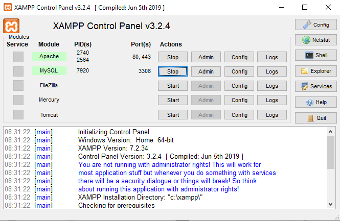

### Langkah -Langkah Pratikum

Alat -Alat yang dibutuhkan
- XAMPP
- Teks editor seperti Sublime text

Untuk memulai membuat aplikasi CRUD sederhana, yang perlu disiapkan adalah
database server menggunakan MySQL. Pastikan MySQL Server sudah dapat dijalankan
melalui XAMPP.

## Menjalankan MySQL Server
Untuk menjalankan MySQL Server dari menu XAMPP Contol.

## Mengakses MySQL Client menggunakan PHP MyAdmin
Pastikan webserver Apache dan MySQL server sudah dijalankan. Kemudian buka
melalui browser: http://localhost/phpmyadmin/

## Membuat Database

## Membuat Tabel

## Menambahkan Data

## Membuat Program CRUD
Buat folder lab8_php_database pada root directory web server (d:\xampp\htdocs)

Kemudian untuk mengakses direktory tersebut pada web server dengan mengakses URL:
http://localhost/lab8_php_database/

## Membuat File Koneksi Database
Buatlah file baru di sublime text dengan nama koneksi.php

Buka melalui browser untuk menguji koneksi database (untuk menyampilkan pesan
koneksi berhasil, uncomment pada perintah echo “koneksi berhasil”;

## Membuat file index untuk menampilkan data (Read)
Buat file baru di sublime text dengan nama index.php

Untuk menampilkan file tersebut buka di browser:http://localhost/lab8_php_database/index.php

## Menambah Data (Create)
Buat file baru dengan nama tambah.php

Untuk menampilkan file tersebut buka di browser:http://localhost/lab8_php_database/tambah.php

## Mengubah Data (Update)
Buat file baru dengan nama ubah.php

Untuk menampilkan file tersebut buka di browser:http://localhost/lab8_php_database/ubah.php

Lihatlah pada tabel hp Realme 5 di bagian stok berhasil diganti

## Menghapus Data (Delete)
Buat file baru dengan nama hapus.php

before
![](foto/21.PNG

after

Lihatlah pada tabel hp Realme 7 sudah berhasil di hapus
